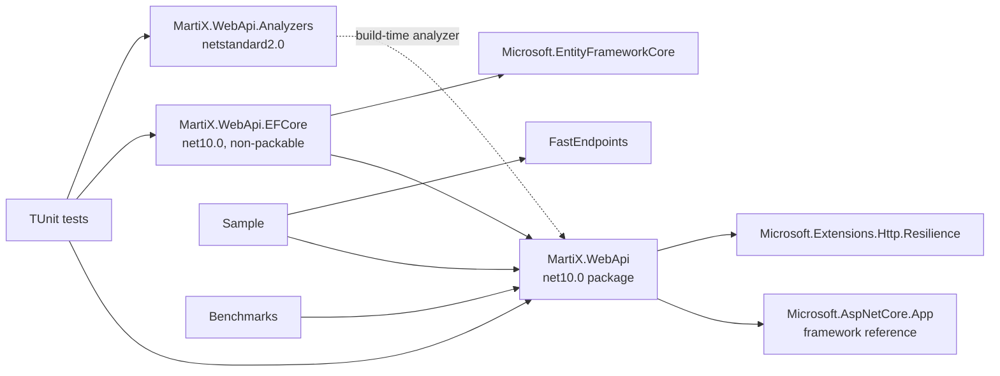

# Current WebApi public-surface and dependency audit

## Scope and method

This audit evaluates the active workspace at commit
`c6bbd9d5fcb3738ca05bce8ef88c72f35d918c82`. The archived implementation is
out of scope. Local source, project files, tests, and workflows are the primary
evidence; Microsoft documentation is used only to establish first-party .NET 10
capabilities and compatibility rules.

The classifications describe the code that exists now, not the capability that
its namespace promises. They use the following meanings:

- **Deep reusable Platform behavior**: a Module with a small stable Interface,
  substantial implementation, high Leverage across applications, and strong
  Locality of change.
- **Generated application/Business Module concern**: useful source that should
  be owned and adapted by each Generated Solution or Business Module.
- **Optional provider/Adapter**: an implementation at a real Seam whose
  dependency or deployment choice varies.
- **Redundant/shallow wrapper**: an Interface that mostly renames or forwards to
  a first-party capability without adding enough policy or behavior.
- **Misleading integration**: its name implies integration with a framework or
  reliability property that the implementation does not supply.
- **Unsafe production default**: convenient behavior that can lose data, weaken
  security, leak information, or behave incorrectly under concurrency or
  multiple instances.
- **Internal/delete candidate**: implementation detail that should not carry a
  public compatibility commitment, or code whose complexity should disappear.

The accepted Wayfinder decisions are the evaluation baseline, especially
[the package baseline](../tickets/013-package-baseline.md),
[direct application operations](../tickets/009-application-dispatch.md),
[explicit mapping](../tickets/010-mapping-policy.md),
[native-first validation](../tickets/011-validation-policy.md),
[module-owned EF Core](../tickets/004-persistence-baseline.md),
[the transactional outbox](../tickets/015-transactional-outbox.md), and
[AOT-conscious compatibility](../tickets/006-aot-policy.md).

## Executive conclusion

`MartiX.WebApi` is currently a broad convenience assembly, not a deep Platform
Library. It has 78 active C# source files and 79 top-level public type or
delegate declarations in the main project (81 when the EF Core project is
included). Its roughly 2.8K physical source lines therefore carry an unusually
large public versioning burden. Only the Result/error model presently has a
credible case for becoming deep reusable Platform behavior, and even that
Interface needs tightened invariants and separation from HTTP semantics.

The package's largest risk is semantic overstatement:

- `Mapster` contains no Mapster dependency or generated Mapster mapping.
- `FastEndpoints` contains no FastEndpoints dependency or endpoint behavior.
- `Mediator` has no sender, dispatcher, registration, or pipeline composition.
- `Versioning` emits headers but performs no endpoint version selection.
- `Outbox` is in-memory, non-transactional, and the EF interceptor writes a
  fixed marker after a successful save.
- `Security` evaluates a request but neither enforces HTTPS nor wires its header
  helper into the request pipeline.

`AddMartiXWebApiDefaults()` makes these optional or unsafe implementations the
automatic baseline. That method should stop being recommended immediately and
be removed in the next breaking release. The target should be a small
framework-independent outcome/error Module, a separate ASP.NET Core Adapter,
generated Business Module primitives, and independently selectable provider
Adapters. Exact package names remain a later topology decision.

## Current project and dependency topology

### Project classification

| Project | Evidence and present role | Classification | Direction |
| --- | --- | --- | --- |
| [`MartiX.WebApi`](../../../../src/MartiX.WebApi/MartiX.WebApi.csproj#L1) | Packable `net10.0` library; one direct resilience package, the full ASP.NET Core shared framework, bundled analyzer project reference, AOT/trim metadata; contains all public concerns | Over-broad Platform assembly; several shallow, misleading, and unsafe Modules | Split around stable Seams; retain only proven deep behavior in the core |
| [`MartiX.WebApi.EFCore`](../../../../src/MartiX.WebApi.EFCore/MartiX.WebApi.EFCore.csproj#L1) | Non-packable; depends on the entire main package and EF Core; exposes one interceptor and one registration extension | Misleading/incomplete provider Adapter | Replace with a real durable outbox persistence Adapter only after the outbox protocol is defined |
| [`MartiX.WebApi.Analyzers`](../../../../src/MartiX.WebApi.Analyzers/MartiX.WebApi.Analyzers.csproj#L1) | Independent `netstandard2.0` analyzer package; one diagnostic | Optional tooling Adapter, but current rule compensates for a weak Result Interface | Keep separate in principle; replace the rule with higher-value architecture and contract diagnostics |
| [`MartiX.WebApi.Sample`](../../../../src/MartiX.WebApi.Sample/MartiX.WebApi.Sample.csproj#L1) | Only project that references FastEndpoints; demonstrates the pseudo-mediator and runtime mapper | Generated example/application concern | Replace with generated preset examples that exercise the canonical Minimal API path and each optional Adapter independently |
| [`MartiX.WebApi.Benchmarks`](../../../../src/MartiX.WebApi.Benchmarks/MartiX.WebApi.Benchmarks.csproj#L1) | Benchmarks two Result factories and an in-memory `IQueryable` specification | Internal quality project | Keep only measured, decision-relevant baselines; do not benchmark code scheduled for deletion |
| [`MartiX.WebApi.Tests`](../../../../tests/MartiX.WebApi.Tests/MartiX.WebApi.Tests.csproj#L1) | One TUnit project references core, EF Core, and analyzer projects | Internal quality project; predominantly unit/component tests | Split later by test layer while retaining TUnit/Microsoft.Testing.Platform |

The graph has no project-reference cycle, but the dependency direction is too
coarse. The EF Core Adapter must reference the entire HTTP-oriented package
because the outbox protocol lives there. Conversely, every core consumer
inherits an ASP.NET Core framework reference and the resilience dependency even
when it only wants `Result<T>`. Optional integrations are namespaces inside the
same assembly rather than independently versioned Adapters.

## Public-area classification

The following table accounts for every meaningful public area and its concrete
implementations. Multiple classifications are intentional where, for example,
an Interface could become valuable but its current default Adapter is unsafe.

| Public area and declarations | Current depth and evidence | Classification | Recommended disposition |
| --- | --- | --- | --- |
| `Results`: `Result`, `Result<T>`, `ResultStatus`, `ApiError`, `ErrorCode`, `ErrorType`, `ValidationError` | Centralizes success/failure invariants, machine codes, and structured errors across callers; this is real Leverage. Current generic and non-generic factories normalize errors differently, `Result` is inheritable, and status names include HTTP-flavored `Ok`/`Created` semantics ([factories](../../../../src/MartiX.WebApi/Results/Result.cs#L35), [generic factories](../../../../src/MartiX.WebApi/Results/Result%7BT%7D.cs#L29), [statuses](../../../../src/MartiX.WebApi/Results/ResultStatus.cs#L6)). Arbitrary `object?` metadata weakens serialization/AOT contracts. | Deep reusable Platform behavior after redesign | **Keep and deepen** in a framework-independent Module; make invalid states unrepresentable, unify factories, constrain metadata, and keep HTTP mapping outside the Interface |
| `PagedResult<T>` | Four-field offset-page DTO with one calculation; pagination policy varies by slice and may be offset-, keyset-, or cursor-based ([source](../../../../src/MartiX.WebApi/Results/PagedResult.cs#L11)). | Generated application/Business Module concern | **Move** to generated slice contracts or a selected pagination capability |
| `Results.AspNetCore.MinimalApiResultExtensions` | Maps the Result model to ASP.NET Core, but returns broad `IResult`, losing typed OpenAPI metadata; every created response uses `/` as its location ([source](../../../../src/MartiX.WebApi/Results/AspNetCore/MinimalApiResultExtensions.cs#L16)). .NET recommends `TypedResults` and `Results<T1,...,TN>` for typed contracts and automatic metadata ([Microsoft](https://learn.microsoft.com/en-us/aspnet/core/fundamentals/minimal-apis/responses?view=aspnetcore-10.0)). | Optional provider/Adapter; current Interface is shallow | **Split and replace** with ASP.NET Core failure mapping plus endpoint-owned typed success results and real resource locations |
| `Exceptions`: `AppException`, five status-specific subclasses; `Http.ExceptionHandler` | Five classes add only default messages and constructors. The handler maps them to HTTP and includes `exception.Message` even for unknown 500 errors ([source](../../../../src/MartiX.WebApi/Http/ExceptionHandler.cs#L13)). ASP.NET Core already supplies `IExceptionHandler`, `IProblemDetailsService`, and ordered handler registration ([Microsoft](https://learn.microsoft.com/en-us/aspnet/core/fundamentals/error-handling?view=aspnetcore-10.0)). | Redundant/shallow exceptions; optional ASP.NET Adapter; unsafe production default for unknown details | **Delete** status exceptions as the normal application failure path; **replace** the handler with safe, composable exception mapping in the ASP.NET Adapter |
| `IClock`, `SystemClock` | One property forwards to `TimeProvider.GetUtcNow()`; DI also registers `TimeProvider.System` ([source](../../../../src/MartiX.WebApi/Abstractions/SystemClock.cs#L6)). `TimeProvider` is the first-party testable time abstraction ([Microsoft](https://learn.microsoft.com/en-us/dotnet/standard/datetime/timeprovider-overview)). | Redundant/shallow wrapper | **Replace** with injected `TimeProvider`; delete both declarations |
| `ICommand<T>`, `IQuery<T>` | Marker Interfaces expose only `typeof(TResponse)` ([command](../../../../src/MartiX.WebApi/Abstractions/ICommand.cs#L7)); they create no behavior without a dispatcher. | Misleading pseudo-mediator; internal/delete candidate | **Delete** from baseline; generated operations are ordinary classes/methods. Reintroduce only in an optional source-generated mediator Adapter |
| `Mediator`: `IRequestHandler`, `RequestHandler`, `IPipelineBehavior`, `IRequestValidator`, two `ValidationBehavior` classes | Recreates a subset of mediator vocabulary but provides no sender, dispatch, discovery, DI composition, or ordered pipeline. Validation loses field identifiers by mapping every message to an empty identifier ([source](../../../../src/MartiX.WebApi/Integrations/Mediator/ValidationBehavior.cs#L11)). | Misleading integration; generated application concern | **Delete** from the baseline. Put operation classes and complex validators in generated slices; isolate a real mediator in an optional Adapter if later forces justify it |
| `ICurrentUser` | A genuine Seam between business rules and identity providers, but its string ID/name shape is an application policy and no Adapter exists ([source](../../../../src/MartiX.WebApi/Abstractions/ICurrentUser.cs#L6)). | Generated application/Business Module concern; future identity Seam | **Move and reshape** into Generated Solution application contracts, then supply selected identity-provider Adapters |
| `ICorrelationContext` | No implementation; `Activity.Current` already carries trace context, while causation belongs to integration-message metadata ([source](../../../../src/MartiX.WebApi/Abstractions/ICorrelationContext.cs#L6)). | Hypothetical Seam; redundant/shallow wrapper | **Delete or move** causation to the integration-event contract; use `Activity` for trace correlation |
| `IDomainEvent`; `IHasDomainEvents`, `HasDomainEventsBase`, `EntityBase<TId>`, `ValueObject` | These types prescribe domain modeling and inheritance. Entity equality treats different derived entity types with the same ID as equal and treats two default IDs as equal ([source](../../../../src/MartiX.WebApi/SharedKernel/EntityBase.cs#L16)). Records and explicit domain types usually provide better Locality. | Generated application/Business Module concern; current bases are unsafe/shallow | **Move** domain-event collection patterns into generated Business Modules; **replace/delete** universal entity and value-object base classes |
| `IUnitOfWork` | Duplicates the shape of `DbContext.SaveChangesAsync` without transaction, concurrency, or multi-resource semantics ([source](../../../../src/MartiX.WebApi/Abstractions/IUnitOfWork.cs#L6)). The accepted persistence decision deliberately does not hide EF Core. | Redundant/shallow wrapper | **Delete**; inject the module-owned context or a deep module-specific persistence Interface where real variation exists |
| `Specifications`: `ISpecification<T>`, `Specification<T>`, `OrderClause<T>`, `SpecificationEvaluator` | Exposes the full query expression, ordering, and paging data structure; implementation simply replays it over `IQueryable` ([source](../../../../src/MartiX.WebApi/Specifications/SpecificationEvaluator.cs#L15)). It lacks projections, includes, tracking policy, provider verification, and count semantics. `Expression.Invoke` composition is not validated against either supported relational provider. | Generated application concern; shallow query wrapper | **Replace** with slice-local EF queries/query objects; only create a specification Module if repeated measured complexity establishes depth |
| `Caching`: `IApplicationCache`, `MemoryApplicationCache`, `CachingOptions`, key/DI extensions | A two-method wrapper over `IMemoryCache`; concurrent misses can all execute the factory and the singleton store is per process ([source](../../../../src/MartiX.WebApi/Caching/MemoryApplicationCache.cs#L21)). .NET `HybridCache` already provides in-process caching plus stampede protection, and can add a distributed tier ([Microsoft](https://learn.microsoft.com/en-us/aspnet/core/performance/caching/hybrid?view=aspnetcore-10.0)). | Redundant/shallow wrapper; unsafe default for multi-instance/stampede-sensitive use | **Replace** with first-party `HybridCache` as the baseline capability; keep provider configuration in host/generated infrastructure |
| `Idempotency`: `IIdempotencyStore`, `IdempotencyRecord`, `IdempotencyOptions`, `InMemoryIdempotencyStore` | Storage CRUD only: no atomic claim, concurrent duplicate suppression, request middleware/filter, response replay protocol, cleanup worker, or durable Adapter. `Ttl` and `HashRequestPayload` are not consumed by the implementation; saving overwrites by key ([source](../../../../src/MartiX.WebApi/Idempotency/InMemoryIdempotencyStore.cs#L13)). | Potential deep Platform behavior, but current Module is shallow; unsafe production default | **Replace**, not layer: first define the end-to-end idempotent execution Interface, then add durable provider Adapters. Retain in-memory only as an explicitly named test/development Adapter |
| `Outbox`: `IOutboxMessage`, `OutboxMessage`, `IOutboxStore`, `InMemoryOutboxStore` | Store methods expose a storage data model, not reliable dispatch semantics. `DequeueUnprocessedAsync` neither dequeues nor leases; multiple dispatchers can select the same mutable message ([source](../../../../src/MartiX.WebApi/Outbox/InMemoryOutboxStore.cs#L22)). | Misleading integration; unsafe production default; replace candidate | **Replace** with the accepted durable transactional outbox protocol, module-owned schema, leasing/retry/idempotency semantics, and explicit dispatcher |
| EF Core outbox: `OutboxSaveChangesInterceptor`, `AddMartiXWebApiEFCoreOutbox` | `SavedChangesAsync` creates `db.saved`/`{}` after the database save and enqueues it in a different in-memory store ([source](../../../../src/MartiX.WebApi.EFCore/Outbox/OutboxSaveChangesInterceptor.cs#L12)); it is therefore not atomic and does not capture integration events. EF documents `SavedChanges` as the end of a successful save ([Microsoft](https://learn.microsoft.com/en-us/ef/core/logging-events-diagnostics/events)). Registration does not attach it to any `DbContext` ([source](../../../../src/MartiX.WebApi.EFCore/DependencyInjection/ServiceCollectionExtensions.cs#L16)). | Misleading integration; unsafe production default; incomplete optional Adapter | **Delete and replace** with transactionally inserted outbox rows in each module context and a separately hosted dispatcher |
| `FastEndpoints`: `IFastEndpointResultMapper`, `DefaultFastEndpointResultMapper`, `FastEndpointResult` | No FastEndpoints reference or FastEndpoints type appears in the Module. It maps only non-generic Result state to an intermediate DTO whose `Payload` is never populated ([source](../../../../src/MartiX.WebApi/Integrations/FastEndpoints/DefaultFastEndpointResultMapper.cs#L12)). | Misleading integration; shallow Adapter | **Delete current implementation**; if supported, build a separately versioned Adapter directly against FastEndpoints and its actual response pipeline |
| `Mapster`: `IMapRegistration`, `IMapRegistry`, `InMemoryMapRegistry`, `IObjectMapper`, `RegistryObjectMapper` | No Mapster dependency is present. It is a runtime dictionary keyed by `(source Type, destination Type)` with object casts ([source](../../../../src/MartiX.WebApi/Integrations/Mapster/InMemoryMapRegistry.cs#L6)). | Misleading integration; runtime service locator; internal/delete candidate | **Delete**; use explicit slice-local mapping and optional compile-time Mapperly as already decided |
| Blazor helpers: two extension classes | Typed-client registration is generic `IHttpClientFactory` wiring, not Blazor behavior. Response mapping encodes a custom Problem Details extension protocol and uses JSON overloads explicitly marked `RequiresUnreferencedCode` and `RequiresDynamicCode` ([source](../../../../src/MartiX.WebApi/Integrations/Blazor/BlazorHttpResponseMessageExtensions.cs#L26)). | Optional client Adapter; partly shallow and not AOT-compatible at call sites | **Move** to an optional generated client/UI capability; use source-generated JSON and a versioned error contract. Rename away from Blazor if the behavior is transport-generic |
| `Observability`: `TelemetryContext`, `TelemetryOptions`, `TelemetryConventions` | Small wrapper creates two `Meter` instances itself; `ServiceName` and `ServiceVersion` are unused, and no code records either duration metric. Microsoft recommends DI-provided `IMeterFactory`, which manages Meter lifetime and test isolation ([Microsoft](https://learn.microsoft.com/en-us/dotnet/core/diagnostics/metrics-instrumentation)). | Redundant/shallow wrapper; generated host concern | **Replace** with first-party `ActivitySource`/`IMeterFactory` instrumentation owned by the Module that performs the operation; configure exporters/resources in Service Defaults/host |
| `Resilience`: extension, options, profile enum | Thin configuration over `AddStandardResilienceHandler`; profiles only alter retry count and can raise it to at least five ([source](../../../../src/MartiX.WebApi/Resilience/HttpClientBuilderExtensions.cs#L16)). It hides the standard pipeline and has no operation-specific safety policy. | Redundant/shallow wrapper; potentially unsafe default | **Replace** with direct first-party standard resilience configuration per typed client. Explicitly disable retries for unsafe HTTP methods unless idempotency is guaranteed ([Microsoft](https://learn.microsoft.com/en-us/dotnet/core/resilience/http-resilience)) |
| `Security`: `SecurityOptions`, evaluator Interface/implementation, header conventions, DI extension | `TrustForwardedProtoHeader` defaults true and reads the raw header from any caller ([options](../../../../src/MartiX.WebApi/Security/SecurityOptions.cs#L6), [evaluator](../../../../src/MartiX.WebApi/Security/DefaultSecurityRequestEvaluator.cs#L19)). Modern ASP.NET Core intentionally trusts forwarded headers only from configured known proxies/networks ([Microsoft](https://learn.microsoft.com/en-us/aspnet/core/breaking-changes/8/forwarded-headers-unknown-proxies?view=aspnetcore-10.0)). Registration neither enforces the result nor applies the header helper. | Unsafe production default; misleading security Module; generated host concern | **Delete evaluator** and configure first-party forwarded headers, HTTPS/HSTS, authentication, authorization, CORS, and headers explicitly in the host. Keep any non-native header policy as reviewed host middleware |
| `Health`: registration extensions and `HealthTags` | Liveness is an always-healthy `AddCheck`; readiness wraps a delegate in `IHealthCheck`. ASP.NET Core already supports check registration, tags, filtering, and distinct liveness/readiness endpoints ([Microsoft](https://learn.microsoft.com/en-us/aspnet/core/host-and-deploy/health-checks?view=aspnetcore-10.0)). | Redundant/shallow wrapper; generated host concern | **Move** endpoint/tag conventions to Service Defaults/generated host; provider packages may add real dependency checks |
| `Versioning`: options, deprecation metadata, header conventions | Generates `api-*`, `sunset`, and link headers but performs no route/header/query version reading, endpoint selection, OpenAPI grouping, or policy enforcement ([source](../../../../src/MartiX.WebApi/Versioning/ApiVersionConventions.cs#L14)). DI only registers options. | Misleading integration; generated API concern | **Rename narrowly or delete**. Select an actual endpoint-versioning policy only when the application has a compatibility requirement |
| `Guard` | Every method forwards to .NET throw helpers, adding a second vocabulary ([source](../../../../src/MartiX.WebApi/Guards/Guard.cs#L19)); .NET 10 analysis explicitly recommends the built-in throw helpers ([Microsoft](https://learn.microsoft.com/en-us/dotnet/fundamentals/code-analysis/quality-rules/ca1512)). | Redundant/shallow wrapper | **Delete** and use `ArgumentNullException`, `ArgumentException`, and `ArgumentOutOfRangeException` throw helpers directly |
| Root `ServiceCollectionExtensions` | `AddMartiXWebApiCore` mixes time, Problem Details customization, and exception mapping; `AddMartiXWebApiDefaults` automatically registers pseudo-FastEndpoints, pseudo-Mapster, telemetry, security, cache, idempotency, in-memory outbox, and version headers ([source](../../../../src/MartiX.WebApi/DependencyInjection/ServiceCollectionExtensions.cs#L28)). Options are callback-only, unbound, and not validated on start. | Shallow composition Module; unsafe production default | **Delete `Defaults`**. Give each retained Module one explicit, idempotent registration Interface; generated host composition selects capabilities and validates configuration |
| Analyzer `MXAI001` | Warns on parameterless `Result.Error()` while the public Result Interface deliberately permits that call and supplies a generic fallback ([analyzer](../../../../src/MartiX.WebApi.Analyzers/ResultErrorWithoutDetailsAnalyzer.cs#L46), [factory](../../../../src/MartiX.WebApi/Results/Result.cs#L100)). | Optional tooling Adapter; current diagnostic is a workaround | **Replace** by enforcing a non-empty error in the Result Interface; reserve analyzers for rules the type system cannot express |

## Cross-cutting findings

### Dependency injection and configuration

The registration Interface gives a false sense of a configured platform:

1. `AddMartiXWebApiCore()` installs framework behavior but the host must still
   call `UseExceptionHandler`; critical middleware order remains outside the
   Module.
2. `AddProblemDetails` assigns `CustomizeProblemDetails` directly. A later
   configuration can replace it, and this callback can replace an earlier one,
   so it is not a safely composable convention.
3. Options types have mutable setters and silent normalization, but no
   configuration sections, validators, or `ValidateOnStart()`. The first-party
   options system supports validators and source-generated AOT-compatible
   validation ([Microsoft](https://learn.microsoft.com/en-us/dotnet/core/extensions/options-validation-generator)).
4. Concrete singleton defaults are registered with `AddSingleton`, not
   `TryAdd`, so capability registration order can unexpectedly replace or
   duplicate registrations. More importantly, the in-memory lifetime is hidden
   behind production-sounding Interfaces.
5. `AddMartiXWebApiDefaults()` violates the accepted optional-capability model:
   choosing the baseline silently chooses storage, mapping, endpoint, security,
   and reliability policy.

### AOT and trimming truthfulness

The main project declares both `IsAotCompatible` and `IsTrimmable`
([project](../../../../src/MartiX.WebApi/MartiX.WebApi.csproj#L25)). Microsoft
documents that `IsAotCompatible` enables the trim, single-file, and AOT
analyzers ([Microsoft](https://learn.microsoft.com/en-us/dotnet/core/deploying/native-aot/)).
An analyzer-clean library build is positive evidence, but it is not an
executable compatibility matrix:

- no consuming application is published with `PublishAot` or trimming in CI;
- `VerifyReferenceAotCompatibility` is not enabled;
- the Blazor response APIs correctly warn that they require unreferenced and
  dynamic code, so those call sites are outside the AOT-compatible subset;
- arbitrary `object` payload/metadata and reflection-based JSON options make
  source-generation contracts difficult;
- the sample's FastEndpoints discovery path is not AOT-published or smoke
  tested; and
- the optional EF Core project does not declare or validate an AOT posture.

The correct claim today is **AOT-analyzer-conscious core assembly**, not
**AOT-verified platform**. A library's truth must ultimately be tested through
small consuming publish applications for each supported capability combination.

### Public compatibility and versioning burden

The compatibility test reads 16 type names from
[`docs/public-api-contract.md`](../../../../docs/public-api-contract.md#L5) and
asserts only that those names still occur among exported types
([test](../../../../tests/MartiX.WebApi.Tests/Compatibility/PublicApiContractTests.cs#L7)).
It does not protect:

- the other 63 public declarations in the main assembly;
- public members, parameters, generic constraints, enum values, constructors,
  or nullability;
- behavioral or serialized HTTP compatibility;
- package contents, dependency changes, or analyzer delivery; or
- compatibility with the latest published NuGet package.

Microsoft's compatibility rules treat removing or renaming public types and
members as breaking changes, and moving types between assemblies requires type
forwarding ([Microsoft](https://learn.microsoft.com/en-us/dotnet/core/compatibility/library-change-rules)).
The SDK's package validation can compare a packed library with a released
baseline and detect breaking API changes
([Microsoft](https://learn.microsoft.com/en-us/dotnet/fundamentals/apicompat/package-validation/overview)).
The current hand-maintained 16-name allowlist should therefore be replaced by
package validation/APICompat plus intentional contract tests.

### Test, CI, and performance evidence

A bounded local run of the documented TUnit command passed **244/244 tests**
with no failures or skips. There are 212 `[Test]` methods across 34 test source
files; data cases account for the higher executed count. The tests are valuable
for current unit behavior, analyzer behavior, and DI resolution.

They do not establish production readiness:

- no `WebApplicationFactory` host tests verify middleware, routing,
  serialization, headers, or the end-to-end error contract;
- no Testcontainers or relational-provider tests verify PostgreSQL/SQL Server
  translation, transactions, or concurrency;
- the outbox interceptor test directly calls `SavedChangesAsync(null!, ...)`
  and asserts the fixed marker, thereby protecting the behavior that must be
  removed ([test](../../../../tests/MartiX.WebApi.Tests/Outbox/OutboxSaveChangesInterceptorTests.cs#L7));
- no architecture tests enforce package or Business Module dependency rules;
- no package-content/APICompat test validates what consumers receive;
- no trimmed or Native AOT publish/smoke lane exists; and
- BenchmarkDotNet projects are neither baselined nor gated in
  [CI](../../../../.github/workflows/quality-analysis.yml#L18).

The workflow does provide useful restore/build/test and zero-warning gates, and
release uses NuGet trusted publishing. Those delivery mechanics should be kept
while the behavioral verification layers are expanded.

## Concrete keep/move/split/replace/delete matrix

| Action | Current assets | Target outcome | Migration implication |
| --- | --- | --- | --- |
| **Keep and deepen** | Result/error value types; TUnit/MTP direction; zero-warning/release mechanics | Small framework-independent outcome/error Module with explicit invariants and stable codes | Breaking factory/type changes require a major version or a compatibility facade; add contract and APICompat baselines first |
| **Move to generated source** | `PagedResult`; current-user and domain-event contracts; aggregate event collection; slice operations/validation; API version policy; health/host conventions | Generated Solution and Business Modules own business semantics and host composition | Existing applications copy/reshape source, then remove package references type by type; universal base-class inheritance needs explicit per-aggregate migration |
| **Split into optional Adapters** | ASP.NET Core Result/problem mapping; identity providers; real FastEndpoints support; durable outbox providers; optional client SDK/UI helpers | Each Adapter depends on its actual framework/provider and on the smallest stable Platform Interface | Use separate packages/projects and independent compatibility/AOT/test matrices; do not expose third-party names from core |
| **Replace with first-party .NET 10** | `IClock`/`SystemClock`, `Guard`, cache wrapper, resilience profiles, raw security evaluator, most health wrappers, telemetry wrapper | `TimeProvider`, throw helpers, `HybridCache`, direct standard HTTP resilience, forwarded-header/HTTPS middleware, ASP.NET health checks, `ActivitySource` and `IMeterFactory` | Mostly source migrations; ship analyzers or obsolete shims only if consumer volume justifies them |
| **Replace with deep Platform behavior** | Idempotency CRUD store; in-memory outbox and EF marker interceptor | End-to-end idempotent execution and durable transactional outbox Modules with explicit operational semantics | No persisted current outbox data exists to migrate, but consumers must rewrite registrations and message contracts; introduce schema migrations with the new Adapter |
| **Delete** | Pseudo-Mapster; pseudo-mediator baseline; current FastEndpoints DTO mapper; `IUnitOfWork`; generic specification framework; status exceptions; `AddMartiXWebApiDefaults`; current `MXAI001` after Result redesign | Complexity disappears instead of being layered over | Treat as an intentional major-version cleanup. If preserving 1.x consumers matters, obsolete first and provide a concise migration analyzer/document |
| **Internalize** | Concrete registries, mapper/store implementations, options/convention helpers that remain during transition | Only stable Interfaces and real Adapter entry points stay public | Internalization is breaking for any direct consumers; APICompat baselines reveal the exact impact |

## Recommended migration sequence

1. **Establish the evidence baseline.** Pack the current released version and
   enable package validation/APICompat; add HTTP contract tests for the current
   public error shape and package-content tests for the analyzer.
2. **Stop widening the unsafe Interface.** Mark `AddMartiXWebApiDefaults()` and
   the misleading integration namespaces as obsolete; remove them from all
   examples immediately. Do not add providers to the current assembly.
3. **Define the deep core.** Specify Result/error invariants, serialization
   policy, nullability, error-code ownership, and AOT contract. Validate it in a
   framework-free package and small consuming apps.
4. **Extract the ASP.NET Core Adapter.** Centralize safe Problem Details and
   correlation behavior, but keep endpoint successes typed and resource-aware.
   Never return unknown exception messages in production.
5. **Move application semantics to the template.** Generate module-owned domain
   primitives, direct operations, explicit mapping, validation, persistence,
   current-user seams, and health/host composition.
6. **Build real provider Adapters one capability at a time.** Begin with the
   transactional outbox because later integration-event communication depends
   on it. Replace existing code rather than wrapping it.
7. **Cut a deliberate major release.** Prefer a clean Platform Interface over
   indefinite shims while adoption is still limited. Use type forwarding only
   when a type moves unchanged; changed semantics require explicit migration.

## Prerequisites for the later Platform Library topology decision

The topology ticket should not assign package names until these facts are fixed:

1. the exact Result/error Interface and which semantics are independent of
   ASP.NET Core;
2. the stable error wire protocol shared by Minimal APIs and optional clients;
3. the generated-source ownership manifest for domain, application, and host
   concerns;
4. dependency rules that make Platform core independent of ASP.NET Core, EF
   Core, identity providers, UI, and optional endpoint frameworks;
5. the outbox and idempotency protocols, including transaction, lease, retry,
   deduplication, cleanup, observability, and clock semantics;
6. supported provider/capability combinations and their explicit composition
   roots;
7. the public compatibility policy: SemVer, obsoletion window, type-forwarding
   rules, package validation baseline, and analyzer versioning;
8. the executable verification matrix: unit, architecture, host, relational
   containers, package content, template generation, trimming, Native AOT, and
   performance; and
9. whether a convenience metapackage is needed. If used, it should compose
   independently useful packages without recreating `AddDefaults()` as hidden
   runtime policy.

## Uncertainties and limits

- The inventory counts source declarations and can differ from reflection
  counts because compiler-generated nested types are intentionally excluded.
- Current NuGet package contents were not repacked during this read-only audit.
  The analyzer project reference works for repository builds, but whether the
  main released package carries the analyzer must be verified with a
  package-content test.
- No external consumer usage data was available. The migration recommendation
  assumes the Platform is early enough that a deliberate major cleanup costs
  less than maintaining the current surface indefinitely.
- Relational translation of the specification expression composer was not
  tested because neither supported relational provider is configured in this
  repository's tests.
- Passing unit tests establish fidelity to current behavior, not correctness of
  the promised integration or production reliability semantics.
